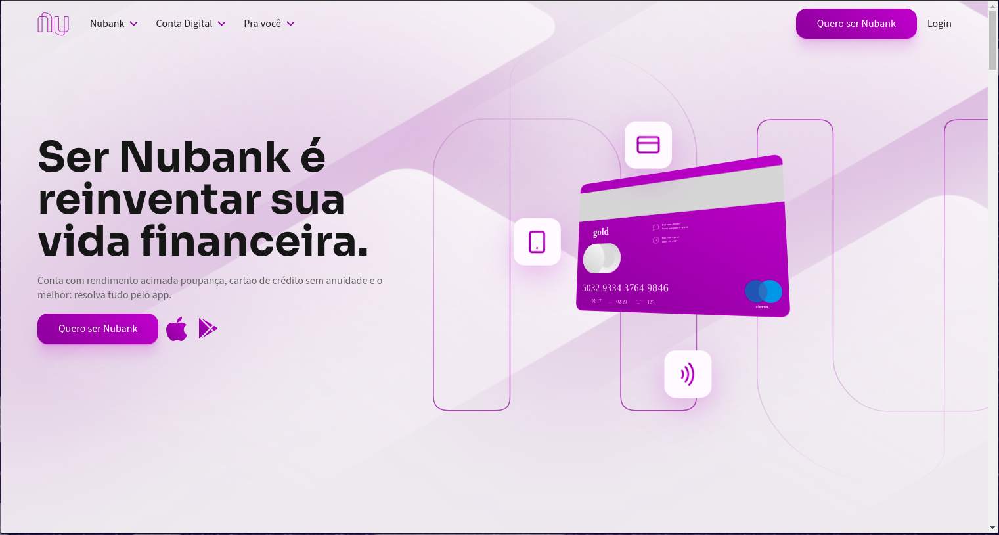
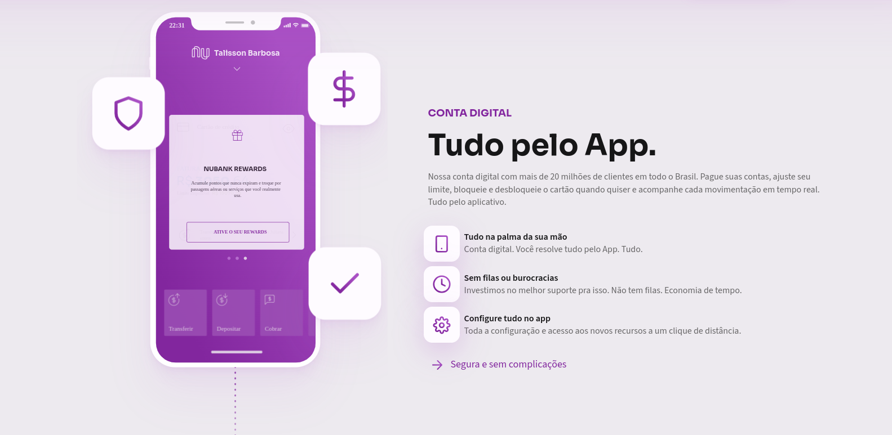
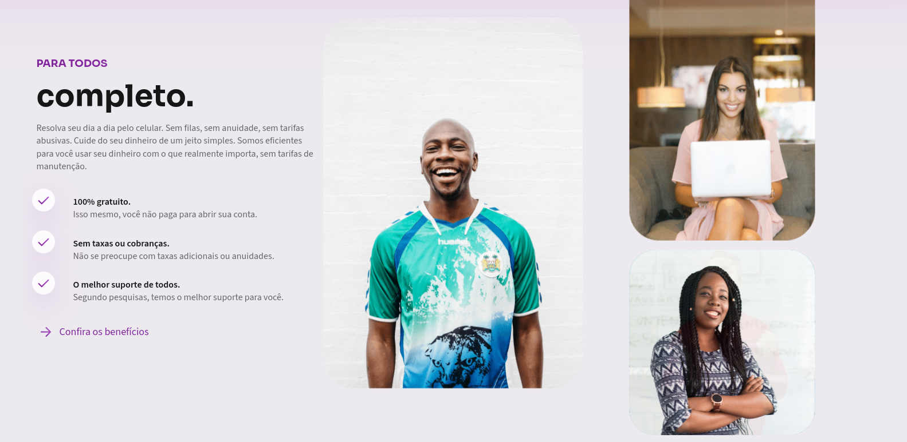
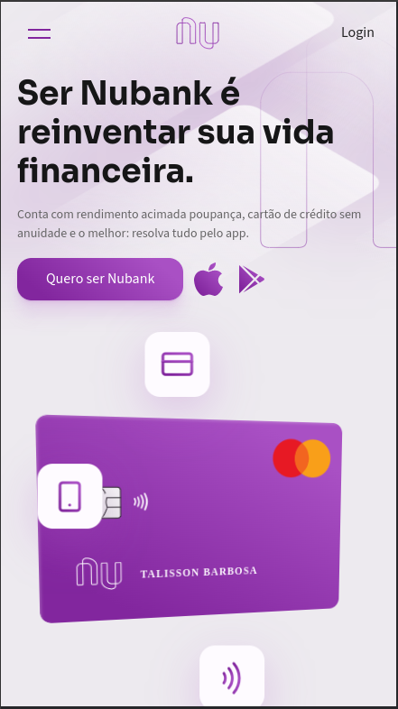
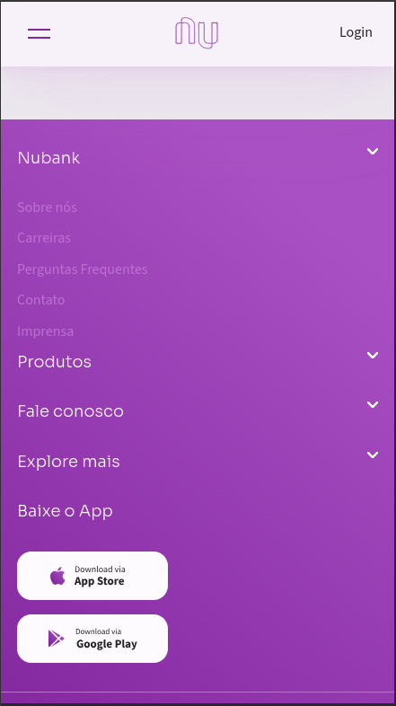

# Bem-vindo ao README do Projeto

🚀 Estou emocionado em compartilhar o resultado do meu mais recente projeto de redesign! 💳✨

🎨 Desenvolvi uma nova versão da página inicial da Nubank, utilizando HTML, JavaScript e SASS para criar um design moderno, funcional e totalmente responsivo. 📱💻🖥️

🔍 Foi um desafio empolgante trabalhar nesse projeto solo, mas estou extremamente orgulhoso do resultado final. Cada linha de código e cada detalhe de design foram cuidadosamente elaborados para proporcionar uma experiência do usuário excepcional. 🛠️✨

## Descrição

Este projeto consiste em um redesign da página inicial da Nubank, utilizando tecnologias web modernas para criar uma experiência de usuário aprimorada e totalmente responsiva.

## Características

- **Design Moderno e Responsivo:** A página é projetada para se adaptar a diferentes dispositivos, proporcionando uma experiência consistente em smartphones, tablets e computadores.
- **Funcionalidade Aprimorada:** Recursos interativos e elementos dinâmicos foram adicionados para melhorar a usabilidade e a interação do usuário.
- **Performance Otimizada:** Utiliza práticas de desenvolvimento para garantir alta performance, resultando em tempos de carregamento rápidos e uma experiência de navegação fluida.

## Instalação

Para visualizar este projeto localmente, siga os seguintes passos:

1. Clone este repositório em sua máquina local:
   ```bash
   git clone https://github.com/Talisson-b99/lp-nubank.git
   ```
2. Abra o arquivo `index.html` em seu navegador web.

## Capturas de Tela








## Feedback

💡 Quer ver como ficou? Confira minha Landing Page Redesign da Nubank e compartilhe seus comentários e feedback! Estou ansioso para ouvir o que você pensa.

## Contato

Se você tiver dúvidas, sugestões ou comentários, não hesite em entrar em contato através do e-mail talissonb422@gmail.com.

Obrigado por conferir meu projeto! 😊
